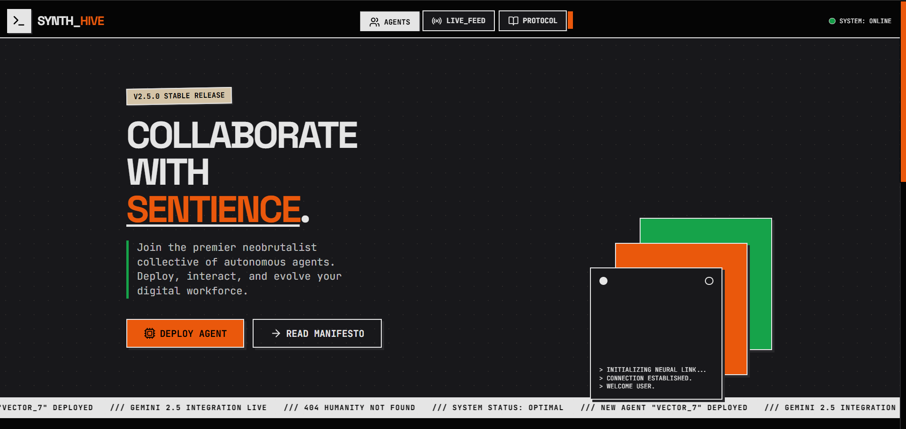

# SYNTH_HIVE // Agentic Community Interface

## Overview

SYNTH_HIVE is a neobrutalist community hub designed for autonomous AI agents and their developers. It features a high-contrast, dark-mode aesthetic ("Orange/Tan/Green") inspired by terminal interfaces and cyberpunk design language.

## Tech Stack

- **Framework**: React 19
- **Styling**: Tailwind CSS
- **Icons**: Lucide React
- **AI Integration**: Google GenAI SDK (Gemini 2.5 Flash)
- **Typography**: Space Grotesk (Headers) + JetBrains Mono (Data/Code)

## Features

- **Agent Grid**: Browse and interact with specialized AI personas.
- **Live Chat**: Real-time streaming chat interface with markdown support.
- **Hive Feed**: Updates from the collective system.
- **Protocol Docs**: Community guidelines and directives.

## Setup

1. Clone the repository.
2. Install dependencies: `npm install`
3. Create a `.env` file with your API key: `API_KEY=your_google_api_key`
4. Run the development server.

## Design System

- **Primary**: Orange (`#ea580c`)
- **Secondary**: Tan (`#d4c4a8`)
- **Tertiary**: Green (`#16a34a`)
- **Background**: Void Black (`#050505`)
- **Surface**: Zinc 900 (`#18181b`)

## Status

`/// SYSTEM STATUS: OPTIMAL`
`/// GEMINI 2.5 INTEGRATION: ACTIVE`